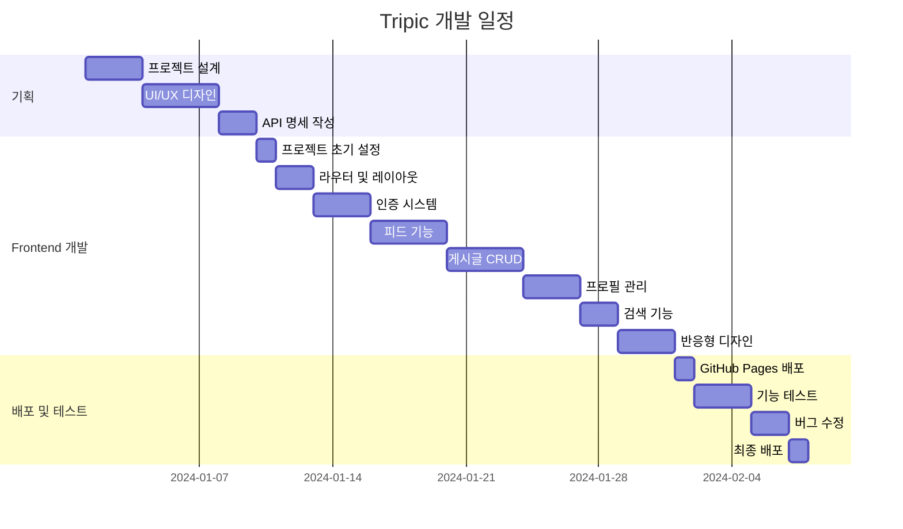
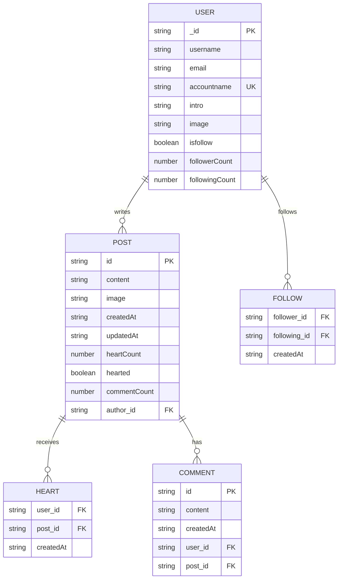

# Tripic - 여행 소셜 플랫폼

## 1. 목표와 기능

### 1.1 목표

- **여행 경험 공유**: 사용자들이 여행 사진과 경험을 자유롭게 공유할 수 있는 플랫폼
- **소셜 네트워킹**: 여행을 좋아하는 사람들 간의 소통과 네트워킹 기회 제공
- **여행 정보 교환**: 실제 여행자들의 생생한 후기와 정보 공유
- **모바일 최적화**: 언제 어디서나 쉽게 접근할 수 있는 반응형 웹 애플리케이션

### 1.2 기능

#### 📱 사용자 관리

- 이메일 기반 회원가입/로그인
- 프로필 관리 (프로필 사진, 소개글, 개인정보 수정)
- 팔로우/언팔로우 시스템
- 팔로워/팔로잉 목록 조회

#### 📝 게시글 관리

- 여행 사진과 글 작성/수정/삭제
- 이미지 업로드 및 미리보기
- 무한 스크롤 피드
- 게시글 좋아요 기능
- 게시글 신고 기능

#### 🔍 소셜 기능

- 사용자 검색
- 피드 타임라인
- 댓글 시스템 (예정)
- 실시간 채팅 (예정)

#### 📱 반응형 디자인

- 모바일 우선 설계
- 데스크톱/태블릿/모바일 대응
- PWA 지원 (예정)

### 1.3 팀 구성

<table>
    <tr>
        <th>Frontend Developer</th>
    </tr>
     <tr>
        <td></td>
    </tr>
</table>

## 2. 개발 환경 및 배포 URL

### 2.1 개발 환경

#### Frontend

- **Framework**: React 18.3.1
- **Language**: TypeScript 5.6.2
- **Build Tool**: Vite 6.0.3
- **Styling**: Tailwind CSS 3.4.17
- **State Management**: React Query (TanStack Query) 5.62.8
- **Routing**: React Router DOM 7.0.2
- **Form Management**: React Hook Form 7.54.2

#### Development Tools

- **Package Manager**: npm
- **Version Control**: Git & GitHub
- **Code Editor**: Visual Studio Code
- **Browser Testing**: Chrome DevTools

#### Deployment

- **Platform**: GitHub Pages
- **CI/CD**: GitHub Actions
- **Domain**: GitHub Pages 기본 도메인

### 2.2 배포 URL

- **Production**: https://username.github.io/tripic/
- **테스트용 계정**
  ```
  Email: demo@tripic.com
  Password: demo123!
  ```

### 2.3 라우터 구조

| 경로                         | 컴포넌트            | 설명               | 로그인 필요 | 비고                                        |
| ---------------------------- | ------------------- | ------------------ | ----------- | ------------------------------------------- |
| `/`                          | Home                | 메인 피드          | ✅          | 로그인 시 피드, 미로그인 시 로그인 페이지로 |
| `/login`                     | Login               | 로그인 선택        | ❌          | 로그인 상태에서 접근 시 홈으로 리다이렉트   |
| `/login/email`               | LoginEmail          | 이메일 로그인      | ❌          | 로그인 상태에서 접근 시 홈으로 리다이렉트   |
| `/signup`                    | SignUp              | 회원가입           | ❌          | 로그인 상태에서 접근 시 홈으로 리다이렉트   |
| `/search`                    | Search              | 사용자 검색        | ✅          |                                             |
| `/my-profile`                | MyProfile           | 내 프로필          | ✅          |                                             |
| `/my-profile/modification`   | ProfileModification | 프로필 수정        | ✅          |                                             |
| `/my-profile/followers`      | Followers           | 팔로워 목록        | ✅          |                                             |
| `/my-profile/followings`     | Followings          | 팔로잉 목록        | ✅          |                                             |
| `/your-profile/:accountname` | YourProfile         | 다른 사용자 프로필 | ✅          |                                             |
| `/post/:postId`              | Post                | 게시글 상세보기    | ✅          |                                             |
| `/post-upload`               | PostUpload          | 게시글 작성        | ✅          |                                             |
| `/post-modification/:postId` | PostModification    | 게시글 수정        | ✅          |                                             |
| `/chat`                      | Chat                | 채팅방 목록        | ✅          | 추후 구현 예정                              |
| `/chat/room`                 | ChatRoom            | 채팅방             | ✅          | 추후 구현 예정                              |

## 3. 요구사항 명세와 기능 명세

### 3.1 주요 기능 플로우


### 3.2 게시글 작성 플로우


## 4. 프로젝트 구조와 개발 일정

### 4.1 프로젝트 구조

```
📦 tripic
┣ 📂 public/
┃ ┣ 📜 vite.svg
┃ ┗ 📜 favicon.ico
┣ 📂 src/
┃ ┣ 📂 api/                    # API 관련 함수들
┃ ┃ ┣ 📂 auth/                 # 인증 관련 API
┃ ┃ ┣ 📂 image/                # 이미지 업로드 API
┃ ┃ ┣ 📂 post/                 # 게시글 관련 API
┃ ┃ ┣ 📂 search/               # 검색 관련 API
┃ ┃ ┣ 📂 signup/               # 회원가입 관련 API
┃ ┃ ┗ 📂 user/                 # 사용자 관련 API
┃ ┣ 📂 assets/                 # 정적 파일들
┃ ┃ ┣ 📜 *.svg                 # SVG 아이콘들
┃ ┃ ┗ 📜 *.png                 # 이미지 파일들
┃ ┣ 📂 component/              # 재사용 가능한 컴포넌트들
┃ ┃ ┣ 📂 Feed/                 # 피드 관련 컴포넌트
┃ ┃ ┣ 📂 Navigation/           # 네비게이션 컴포넌트
┃ ┃ ┗ 📜 *.tsx                 # 공통 컴포넌트들
┃ ┣ 📂 context/                # React Context들
┃ ┃ ┗ 📜 ModalContext.tsx      # 모달 상태 관리
┃ ┣ 📂 hooks/                  # 커스텀 훅들
┃ ┃ ┣ 📜 useIntersectionObserver.ts
┃ ┃ ┗ 📜 useModal.ts
┃ ┣ 📂 pages/                  # 페이지 컴포넌트들
┃ ┃ ┣ 📂 Home/                 # 홈 페이지
┃ ┃ ┃ ┣ 📂 component/
┃ ┃ ┃ ┗ 📜 Index.tsx
┃ ┃ ┣ 📂 Login/                # 로그인 페이지
┃ ┃ ┣ 📂 SignUp/               # 회원가입 페이지
┃ ┃ ┣ 📂 MyProfile/            # 내 프로필 페이지
┃ ┃ ┣ 📂 PostUpload/           # 게시글 작성 페이지
┃ ┃ ┗ 📂 Search/               # 검색 페이지
┃ ┣ 📂 types/                  # TypeScript 타입 정의
┃ ┃ ┗ 📜 commonType.ts
┃ ┣ 📂 utils/                  # 유틸리티 함수들
┃ ┃ ┗ 📜 auth.ts               # 인증 관련 유틸리티
┃ ┣ 📜 App.tsx                 # 메인 App 컴포넌트
┃ ┣ 📜 MainApp.tsx             # 라우터 및 전역 설정
┃ ┣ 📜 main.tsx                # 앱 진입점
┃ ┗ 📜 index.css               # 전역 스타일
┣ 📜 package.json
┣ 📜 vite.config.ts            # Vite 설정
┣ 📜 tailwind.config.js        # Tailwind CSS 설정
┣ 📜 tsconfig.json             # TypeScript 설정
┗ 📜 README.md
```

### 4.2 개발 일정



## 5. 역할 분담

- **팀장 & Frontend Developer**: [이름]
- **UI/UX 디자인**: [이름]
- **API 연동**: [이름]
- **테스트 및 배포**: [이름]

## 6. 와이어프레임 / UI / BM

### 6.1 와이어프레임

- 피그마를 사용하여 와이어프레임을 제작했습니다.
  

### 6.2 화면 설계

<table>
    <tbody>
        <tr>
            <td>로그인</td>
            <td>회원가입</td>
        </tr>
        <tr>
            <td>
                
            </td>
            <td>
                
            </td>
        </tr>
        <tr>
            <td>메인 피드</td>
            <td>게시글 작성</td>
        </tr>
        <tr>
            <td>
                
            </td>
            <td>
                
            </td>
        </tr>
        <tr>
            <td>프로필</td>
            <td>검색</td>
        </tr>
        <tr>
            <td>
                
            </td>
            <td>
                
            </td>
        </tr>
    </tbody>
</table>

## 7. 데이터베이스 모델링(ERD)



## 8. Architecture


## 9. 주요 기능

### 9.1 무한 스크롤 구현


### 9.2 인증 시스템


### 9.3 게시글 관리

- **게시글 작성**: 이미지 업로드와 텍스트 입력을 통한 게시글 생성
- **게시글 수정**: 작성자만 수정 가능한 권한 시스템
- **게시글 삭제**: 작성자만 삭제 가능한 권한 시스템
- **좋아요 기능**: 실시간 좋아요 수 업데이트
- **무한 스크롤**: Intersection Observer를 활용한 성능 최적화

### 9.4 소셜 기능

- **팔로우/언팔로우**: 사용자 간 팔로우 관계 설정
- **사용자 검색**: 계정명 기반 사용자 검색
- **프로필 조회**: 다른 사용자의 프로필 및 게시글 확인
- **팔로워/팔로잉 목록**: 관계 목록 조회

## 10. 개발하며 느낀점

### 10.1 기술적 성장

**React Query의 강력함을 경험**

- 서버 상태 관리의 복잡성을 크게 줄여줌
- 캐싱, 동기화, 에러 처리가 매우 편리함
- 무한 스크롤 구현이 간단해짐

**TypeScript의 중요성 재확인**

- 런타임 에러를 컴파일 타임에 발견
- API 응답 타입 정의로 개발 효율성 증대
- 리팩토링 시 안정성 보장

**모바일 퍼스트 설계의 중요성**

- 반응형 디자인을 처음부터 고려하는 것이 중요
- Tailwind CSS의 반응형 클래스 활용
- 터치 친화적 UI 설계 필요성

### 10.2 아쉬운 점 및 개선사항

**상태 관리 구조**

- 전역 상태와 로컬 상태의 경계 설정이 어려웠음
- Context API와 React Query의 역할 분담 고민

**컴포넌트 구조**

- 재사용 가능한 컴포넌트 설계에 더 신경 써야 함
- Props drilling 문제 해결 필요

**테스트 코드**

- 단위 테스트와 통합 테스트 부족
- 다음 프로젝트에서는 TDD 접근법 시도 예정

### 10.3 배운 점

**협업의 중요성**

- API 명세서의 중요성 (백엔드와의 소통)
- Git 브랜치 전략의 필요성
- 코드 리뷰 문화의 중요성

**사용자 경험**

- 로딩 상태 처리의 중요성
- 에러 메시지의 사용자 친화성
- 접근성(Accessibility) 고려사항

**성능 최적화**

- 번들 사이즈 최적화
- 이미지 최적화
- 네트워크 요청 최적화

### 10.4 향후 개발 계획

**단기 계획 (1-2주)**

- [ ] 댓글 시스템 구현
- [ ] 게시글 검색 기능
- [ ] 알림 시스템
- [ ] PWA 대응

**중기 계획 (1-2개월)**

- [ ] 실시간 채팅 기능
- [ ] 게시글 태그 시스템
- [ ] 위치 기반 서비스
- [ ] 다크 모드 지원

**장기 계획 (3-6개월)**

- [ ] 모바일 앱 개발 (React Native)
- [ ] AI 기반 추천 시스템
- [ ] 다국어 지원
- [ ] 성능 최적화 및 분석

---

## 라이선스

MIT License

## 연락처

프로젝트 관련 문의: [이메일 주소]
